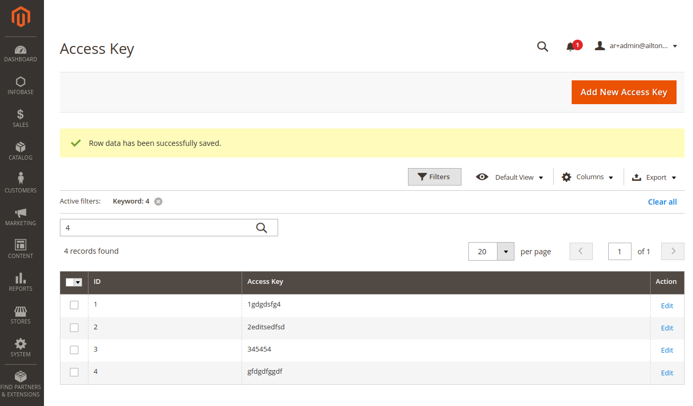
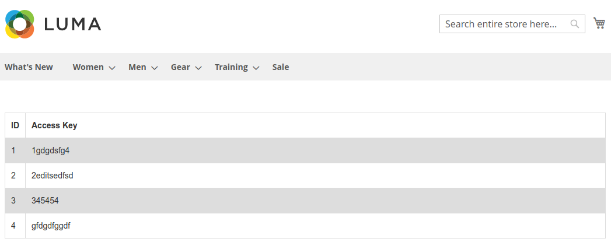

# Infobase IT

### Infobase_Grid

Below are requirements extracted from the source repository README.md, followed by the tasks that were performed to meet the requirements.

> Primeiramente, faça um fork e clone do projeto;
> Crie uma branch com o seu nome e sobrenome, exemplo: **"backend-nome-sobrenome"**;

- [x] https://github.com/ribahh-4738/backend-challenge-two/tree/backend-ailton-ribeiro

> Escolha uma entidade de sua prefêrencia para que possa desenvolver um CRUD completo.

- [x] code: entidade escolhida Customer

> O nome do módulo fica a sua escolha, solicitamos apenas que esteja na vendor "Infobase";

- [x] code: Grid

> Painel Administrativo
> 	GRID 
> 		Deve ser possível cadastrar/listar/editar/deletar um registro.
> 		
> No painel administrativo, deverá conter uma GRID listando o conjunto das informações de sua entidade escolhida.
>
> GRID (deve ser possível filtrar e ordenar as colunas)

- [x] code: module from scratch 
- [x] code: grid, routes + menu
- [x] code: db schema, table `infobase_accesskey_grid`
- [x] code: grid, insert + update
- [x] code: grid, filters + sort
- [x] code: grid, bug on delete via mass action - disabled 

No **Admin**, menu **Infobase**, opção **Access Key**.

A intenção do módulo é criar Chaves de Acesso para os usuários (em um segundo momento pode ser programado o fluxo completo, neste momento está disponível o CRUD para administração das Chaves de Acesso via Magento Admin).



> Front-End
> 	Listagem dos dados 
>
> Com os dados salvos em banco, crie uma listagem das informações em alguma rota personalizada no front-end.
>
> Não há necessidade de um layout complexo com várias camadas de CSS.

- [x] code: interface

No **Front-end**, URL /accesskey/list/all/ está disponível a listagem a seguir:



> O que nós não gostaríamos:
> 	Ver commits grandes, sem muita explicação nas mensagens em seu repositório
>
> O que avaliaremos de seu projeto:
> 	Histórico de commits do git

Os primeiros commits possuem mais arquivos, por se tratatem da estrutura inicial, conforme fui testando e eventualmente encontrando algum desafio, o número de commits foi aumentando e ficando mais específico.

> Entre os critérios de avaliação estão:
> 	Código limpo e organização

Utilizando Mess Detector e PHP CodeSniffer.


## Installation details

1. clone

```bash
git clone https://github.com/ribahh-4738/backend-challenge-two.git
```

2. checkout specific branch `backend-ailton-ribeiro`

```bash
cd backend-challenge-two
git checkout backend-ailton-ribeiro 
```

3. copy `Infobase` folder to app/code

```bash
cp -r Infobase [instalation_path]/app/code/
```

4. install

```bash
bin/magento module:enable Infobase_Grid
bin/magento setup:upgrade
```

For information about a module installation in Magento 2, see [Enable or disable modules](https://devdocs.magento.com/guides/v2.4/install-gde/install/cli/install-cli-subcommands-enable.html).

## Extensibility

Extension developers can interact with the **Infobase_Grid** module. For more information about the Magento extension mechanism, see [Magento plug-ins](https://devdocs.magento.com/guides/v2.4/extension-dev-guide/plugins.html).

[The Magento dependency injection mechanism](https://devdocs.magento.com/guides/v2.4/extension-dev-guide/depend-inj.html) enables you to override the functionality of the **Infobase_Grid** module.

### Layouts

**Infobase_Grid** module introduces layout handles in the `view/adminhtml/layout` directory.

For more information about a layout in Magento 2, see the [Layout documentation](https://devdocs.magento.com/guides/v2.4/frontend-dev-guide/layouts/layout-overview.html).

### UI components

You can extend product and category updates using the UI components located in the `view/adminhtml/ui_component` directory.

For information about a UI component in Magento 2, see [Overview of UI components](https://devdocs.magento.com/guides/v2.4/ui_comp_guide/bk-ui_comps.html).

## Additional information

For information about significant changes in patch releases, see [Release information](https://devdocs.magento.com/guides/v2.4/release-notes/bk-release-notes.html).
